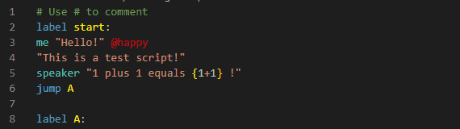
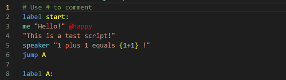

# DS Scripts Support README

This is an extension that adds many support functions for [DS](https://github.com/curefate/DialogueScripter) language scripts.

Feel free to [contribute](https://github.com/curefate/dialoguescripter-extension), thanks for any feedback. ;D

## Features
### Syntax Highlighting (with a nice theme!)

### Error Check

### Definition jumping

## Requirements

- .NET 8 or greater

<!--## Extension Settings

Include if your extension adds any VS Code settings through the `contributes.configuration` extension point.

For example:

This extension contributes the following settings:

* `myExtension.enable`: Enable/disable this extension.
* `myExtension.thing`: Set to `blah` to do something.-->

## Known Issues

- Error messages have not been adjusted.